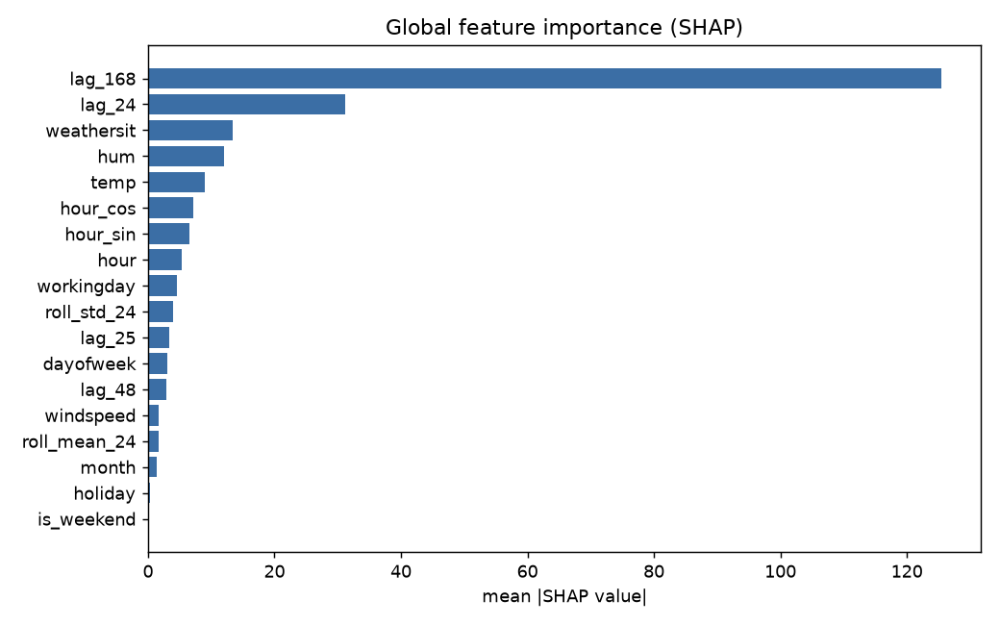

# surecast

**A day-ahead demand forecaster that tells you how confident it is - and why.** Calibrated prediction intervals (not just point forecasts) via conformalized quantile regression, SHAP explainability, honest rolling-origin backtesting, and a Streamlit dashboard. On real UCI bike-share data.

> Most forecasting portfolios stop at model.fit() and a line chart. This one quantifies uncertainty and validates that the uncertainty is calibrated, explains every prediction, and is ruthless about the one thing that quietly ruins time-series ML: data leakage.


## Results

All numbers below come from artifacts/metrics.json, produced by surecast backtest (5-fold expanding-window rolling-origin CV over 15,439 hourly samples). Nothing here is hand-typed.

| model | MAE | RMSE | sMAPE | 90% coverage | interval width |
|---|---|---|---|---|---|
| SeasonalNaive (baseline) | 55.71 | 94.91 | 34.97% | - | - |
| GBM (gradient boosting) | **42.67** | **67.41** | **31.02%** | - | - |
| Conformal (CQR) | 49.04 | 78.46 | 32.07% | **0.875** | 201.8 |

The gradient-boosted model cuts MAE 23% below the seasonal-naive baseline. The conformal model trades a little point accuracy (its point estimate is the predictive median, robust to skew) for something the others don't have: a prediction interval you can trust.

## The calibration story (the honest, hard part)

The conformal 90% interval achieves 87.5% empirical coverage on held-out folds - close to, but modestly below, the 90% target. That gap is not a bug, and hiding it would be the wrong move:

- Conformalized quantile regression (Romano et al., 2019) guarantees coverage under exchangeability. On exchangeable synthetic data this exact code hits nominal coverage almost exactly (0.900 averaged over 40 seeds - see tests/test_models.py).
- A real demand series is not exchangeable: later backtest folds meet seasonal growth and weather regimes the calibration window never saw, so intervals run slightly narrow.
- The fix is time-aware conformal (weighted/adaptive conformal, or online recalibration) - noted in the model card's limitations and the roadmap below.

Understanding why the guarantee bends on real data is the difference between using conformal prediction and copying it.

## Explainability



SHAP over the gradient-boosted model recovers the intuitive structure of bike demand: same-hour-last-week (lag_168) dominates, followed by yesterday's same hour (lag_24) and temperature. The dashboard also renders per-prediction local explanations.

## No data leakage - enforced, not hoped

Time-series ML dies from leakage, so the framing is strict and tested:

- **Day-ahead (24h horizon).** cnt[t] is predicted from information available at t - 24h: calendar features of t, a weather forecast for t, and target lags of >= 24 hours only. No lag shorter than the horizon is ever a feature; rolling stats use windows ending at t - 24h.
- A perturbation-based leakage guard test (tests/test_features.py) spikes cnt[p] and asserts no feature row in the forbidden window [p, p+23] changes - plus a meta-test proving that same check fails against a naive lag_1 implementation, so the guard has teeth.
- The conformal calibration set never trains the quantile models; the backtest asserts every fold's train indices strictly precede its test indices.

This project was built by a swarm of agents against a written contract, then hardened by three adversarial reviewers (one dedicated entirely to hunting leakage). Their process and findings are in docs/REVIEW.md.

## Run it

```bash
git clone https://github.com/saikirankoppichetti/surecast && cd surecast
uv sync
uv run surecast fetch                    # download + cache UCI hour.csv
uv run surecast backtest --out artifacts # rolling backtest -> artifacts/metrics.json
uv run surecast report                   # regenerate docs/model_card.md
uv run streamlit run src/surecast/dashboard.py   # interactive dashboard
```

The model card (auto-generated from the metrics) documents framing, results, calibration, and limitations.

## Tests & CI

```bash
uv run pytest -q     # 66 tests: leakage guards, conformal coverage, metrics, backtest, SHAP, CLI
uv run ruff check src tests && uv run mypy src
```

CI runs lint, types, and the full suite on every push.

## Stack

Python 3.12 | pandas | scikit-learn (HistGradientBoostingRegressor, quantile loss) | SHAP | Streamlit | matplotlib. No external services; everything runs locally.

## What I'd build next

- **Time-aware conformal** (adaptive / weighted) to close the coverage gap on non-exchangeable data.
- **Multi-step recursive** forecasting beyond the 24h horizon, with horizon-indexed intervals.
- Swap in **LightGBM** and a proper **hyperparameter search** in the backtest loop.
- Degrade weather inputs to actual forecasts to measure the real-world cost of the perfect-weather assumption.

## Maintainer

**Sai Kiran Koppichetti** is an AI/ML Engineer with over 5 years of experience across machine learning, data science, and analytics. He focuses on building reliable ML systems, ranging from gradient-boosted risk models to advanced RAG and agentic pipelines. His work emphasizes evaluation and uncertainty quantification to ensure model outputs can be trusted in production environments.

- **GitHub:** https://github.com/saikirankoppichetti
- **LinkedIn:** https://www.linkedin.com/in/saikirankoppichetti97/
- **Email:** koppichettisaikiran97@gmail.com